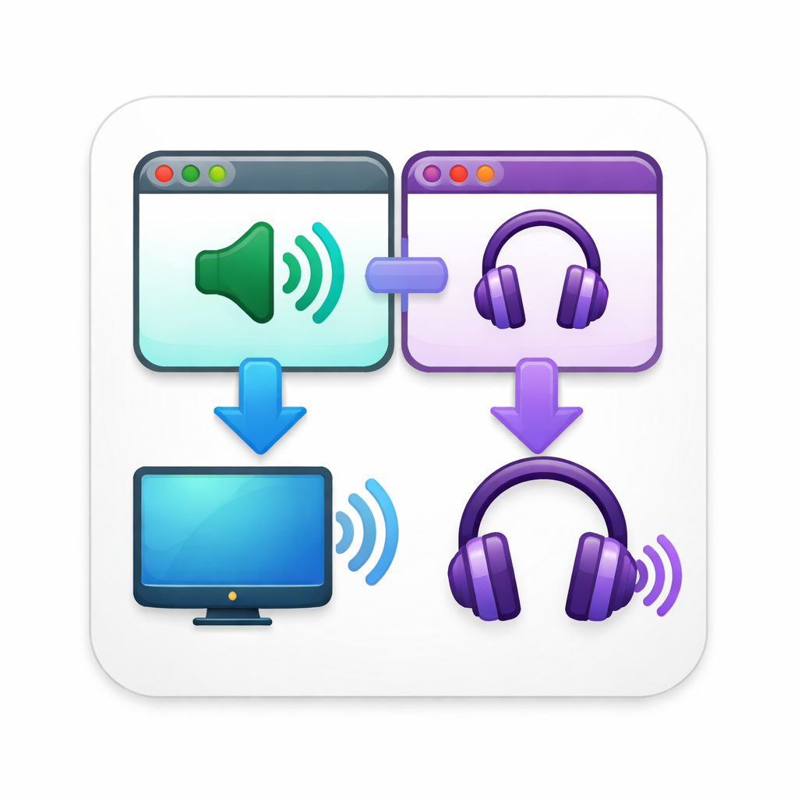

# Tab Audio Router

> Send **each browser tab’s audio to a different device** on Mac.  
> Example: YouTube → TV, Zoom → Headphones.

---

## Why this exists

macOS + browsers don’t let you easily control audio **per tab**.

This fixes that — right from the **right-click menu**.

---

## How it works

- *May ask for microphone access* so Chromium can label output devices.
- Right-click the **video or audio** element.  
- Open **Audio outputs → Choose output…** and pick a device in the on-page list, or use **Use system default**.  
- Done — that player now uses the output you chose.

---

## What you can do

- 🎧 Zoom in headphones, music on speakers  
- 📺 Send a tab to your TV while working on laptop audio  
- 🔀 Run multiple tabs with different outputs

---

## Install (30 seconds)

1. Download / clone this repo  
2. Go to `chrome://extensions`  
3. Enable **Developer Mode**  
4. Click **Load unpacked** → select this folder  

---

## Limitations (important)

- Only works on sites using standard `<audio>/<video>`  
- Needs to be tested on web apps(Ex: Zoom web, Spotify web)
- Needs to be tested on browswers (Ex: Chrome, Arc, Brave, Edge)  

---

## Status

Early tool. Works well on common sites, not universal yet.

Tested on:
- [ ] **Chrome** — macOS  
- [ ] **Chrome** — Windows  
- [ ] **Edge** — Windows  
- [ ] **Brave** — macOS  
- [x] **Arc** — macOS
      - Version 1.143.2 (79250) Chromium Engine Version 147.0.7727.102  
- [ ] **Chromium** — Linux
 
---
