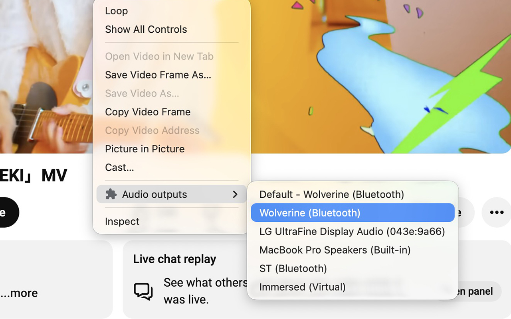

# Tab Audio Router


(img.jpg)

> Route **this tab’s** `<audio>` / `<video>` to a speaker or headset.  
> Uses Chromium’s **`setSinkId`** from the right‑click menu.

---

## What it does

- Picks an **output device** for media on the page you’re on.
- Lives in the **context menu** — no clutter in the toolbar.
- **Chromium only** (Chrome, Edge, Brave, Arc, etc.). Not Firefox.

---

## Quick look

```
    ┌──────────────┐         ┌─────────────────┐
    │   Browser    │  sink   │   🔊 Speakers   │
    │   tab media  │ ──────► │   🎧 Headset    │
    └──────────────┘         └─────────────────┘
           │
           └── Sound Output ▸ Choose output…
```

---

## Install (3 steps)

1. **Get the folder**  
   - Clone this repo, or unzip the project so you have the extension root on disk.

2. **Open extensions**  
   - Go to `chrome://extensions`  
   - Turn **Developer mode** **ON** (top right).

3. **Load unpacked**  
   - Click **Load unpacked**  
   - Select the **project folder** (the one that contains `manifest.json`).

Done. Pin the extension if you like — routing is from **right‑click** on the page or media.

---

## How to use

- Right‑click the **page** or a **video / audio** element.
- Open **Sound Output** → **Choose output…** (or **Use system default**).
- Grant **microphone** if the browser asks — Chromium uses it to unlock the full device list. Then pick your output.

---

## Notes

- Some sites block or sandbox media; routing may not apply everywhere.
- Version and permissions live in `manifest.json`.

---

## Tested on

Tick what you have verified:

- [ ] **Chrome** — macOS  
- [ ] **Chrome** — Windows  
- [ ] **Edge** — Windows  
- [ ] **Brave** — macOS  
- [x] **Arc** — macOS
      - Version 1.143.2 (79250) Chromium Engine Version 147.0.7727.102  
- [ ] **Chromium** — Linux  

---

*Unofficial helper. Not affiliated with Google or browser vendors.*
